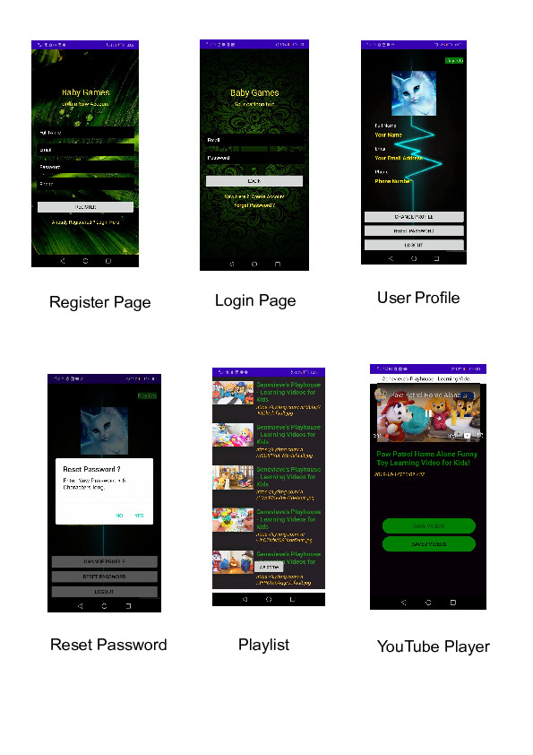

# GameKids App

### Gloria Mutie

## Description 
An application for parents,teachers and children for learning. It aims at teaching kids colors and shapes in an interactive manner where kids through playing games.

## -- Background Information --
YouTube Android Player API enables you to incorporate video playback functionality into your Android applications.You can load or cue videos into a player view embedded in your application's UI. You can then control playback programmatically. For example, you can play, pause, or seek to a specific point in the currently loaded video.

 ## Technologies Used

• Retrofit

• Picasso square for the Image Network

• Material design

• Android-studio IDE

• XML

•  Java

•  Markdown

•  Gradle

## Setup/Installation and Usage
- Clone this repository and open with Android Studio
- https://github.com/gloriamutie/ColorApp
- Emulate on a virtual Machine or on your Phone Device
- Get your API key https://developers.google.com/youtube/android/player/downloads/YouTubeAndroidPlayerApi-1.2.2.zip
- |Replace with your API key
- `public static final String API_KEY = "your secret api key";`

## Quick Demo of the App
What you get after starting the app     
 

## TECHNNOLOGIES USED
- Java
- Android Studio
- Xml
- Roboelectric
- Espresso
- Postman - For testing the responses from the endpint params.

## Api Used
-YouTube Android Player API - https://developers.google.com/youtube/android#youtube-android-player-api

## Brief Scope of the Api
* End point used: 
-Playlists: list
- -Returns a collection of playlists that match the API request parameters. For example, you can retrieve all playlists that the authenticated user owns, or you can retrieve one or more playlists by their unique IDs.

### LICENSE

Copyright (c) 2020 gloria mutie

Permission is hereby granted, free of charge, to any person obtaining a copy
of this software and associated documentation files (the "Software"), to deal
in the Software without restriction, including without limitation the rights
to use, copy, modify, merge, publish, distribute, sublicense, and/or sell
copies of the Software, and to permit persons to whom the Software is
furnished to do so, subject to the following conditions:

The above copyright notice and this permission notice shall be included in all
copies or substantial portions of the Software.

THE SOFTWARE IS PROVIDED "AS IS", WITHOUT WARRANTY OF ANY KIND, EXPRESS OR
IMPLIED, INCLUDING BUT NOT LIMITED TO THE WARRANTIES OF MERCHANTABILITY,
FITNESS FOR A PARTICULAR PURPOSE AND NONINFRINGEMENT. IN NO EVENT SHALL THE
AUTHORS OR COPYRIGHT HOLDERS BE LIABLE FOR ANY CLAIM, DAMAGES OR OTHER
LIABILITY, WHETHER IN AN ACTION OF CONTRACT, TORT OR OTHERWISE, ARISING FROM,
OUT OF OR IN CONNECTION WITH THE SOFTWARE OR THE USE OR OTHER DEALINGS IN THE
SOFTWARE.